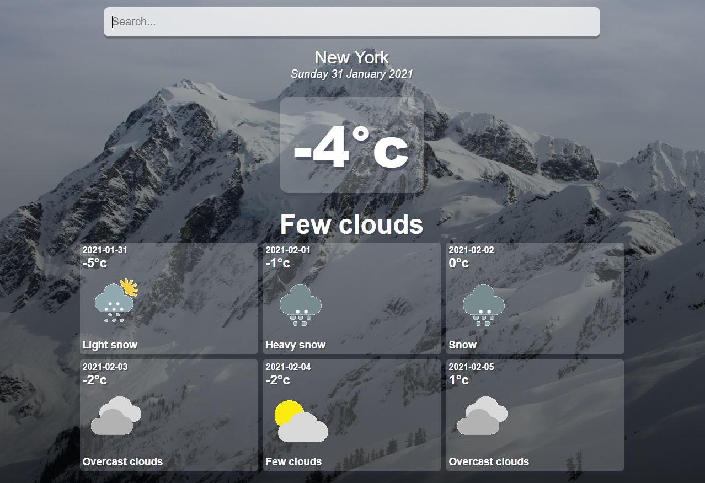

# Weather Forcasting App

### You can view this application live by clicking [here.](https://weatheria-forcasting.web.app/)

  

## About

#### This is a Weather Forcasting App where the users can input the name of a city or country and get weather information about the current time as well as a weather forecasting for the coming days of the week.

#### This application utilizes the WeatherBit API to fetch information based on the location that the user input, information such as weather temperature in three different metrics, a description about the current weather, icons that can be used to display how the weather looks like and much more.

#### This project was made with React and CSS for the styling. Parts of the application such as the weekday are split into separate components for reusability and to avoid repetition. Functions used throughout the whole application are all gathered into a separate file and used as imports in order to make the code cleaner.

## Stack

- ##### CSS
- ##### Javascript
- ##### ReactJS

## To run the site on your local machine

#### If you wish to run this locally you will to first need clone this repository to your local machine. Afterwards you will have to run npm install inside the project directory for all the necessary dependencies to be installed. After the installation of all the dependecies is compltetted will need to run the command npm start and a new window should open automatically on your browser displaying the client side of the app which runs on “http://localhost:3000/”.
